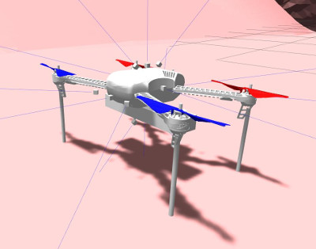
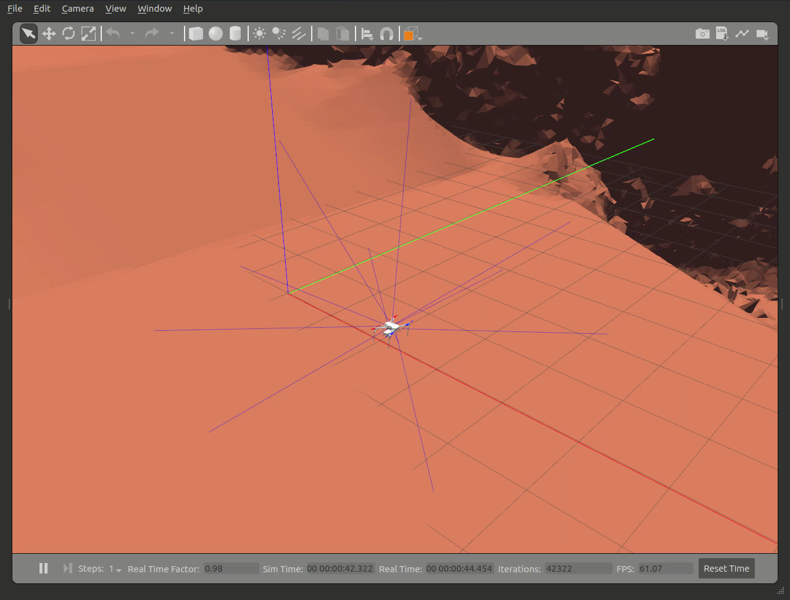
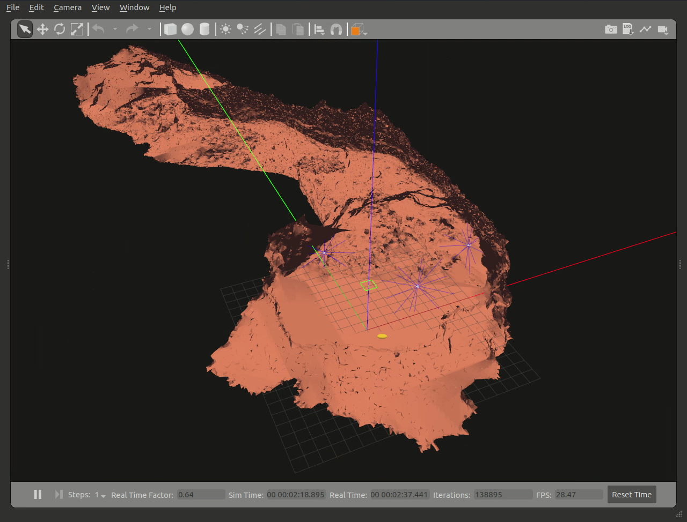
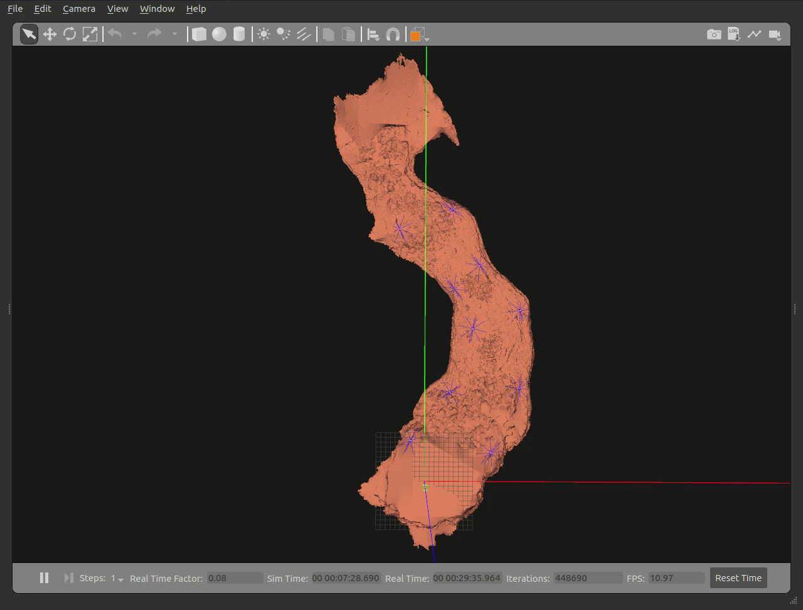
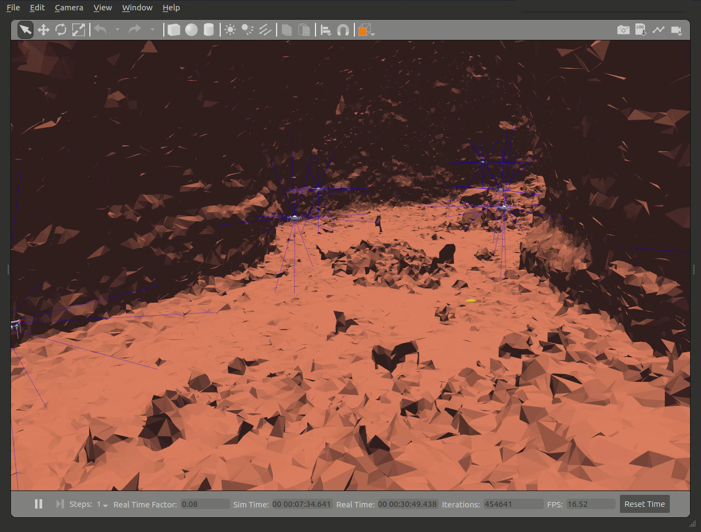
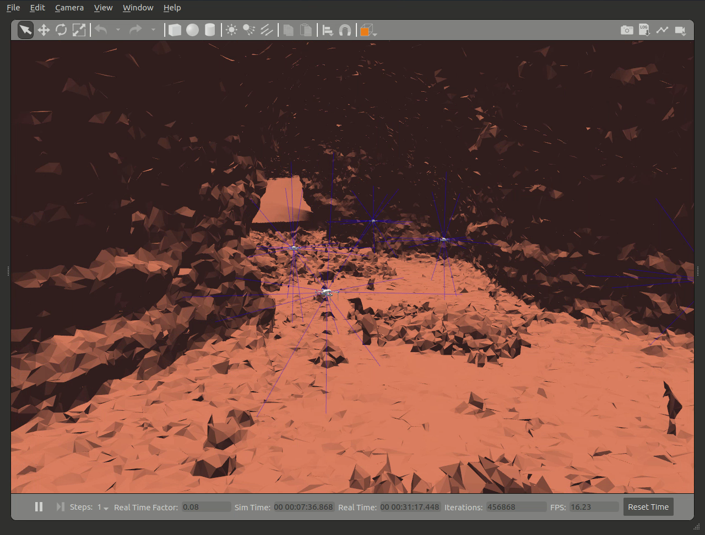

# MAV navigation in an enclosed environment

This repository contains ROS nodes for MAV navigation in a cavern tunnel environment
which is simulated by Gazebo.

The previous work is https://github.com/tidota/quadrotor-tunnel-nav, which used
the `hector_quadrotor` package.
This repo uses the [rotorS](https://github.com/ethz-asl/rotors_simulator) package instead.

## MAV model from rotorS



## Deployment of the robots into the simulation environment

The environment model is based on the dataset of Indian Tunnel, which was originally created by CMU and is currently maintained by NASA.
https://ti.arc.nasa.gov/dataset/caves/








# Inter-robot Communication
Multiple robots perform cooperative localization by interactions with their neighbors while each individual robot performs individual SLAM.

Each robot broadcasts a beacon packet at a certain interval. Other robots receive the packet if they are in the communication range, and send a beacon packet back to the sender. This process enables the robots to know who are their neighbors.

# Control
The direction of a robot to move is determined by a reactive controller. The controller is composed of multiple components each of which generates a simple behavior based on proximity sensory data.

Information in a beacon packet is also used. It contains the relative location of the neighbor with respect to the robot. If it tells that the robot is too close to the neighbor compared to a certain range, the robot tries to move away. If it is farther away, on the other hand, it tries to go toward the neighbor.

# Installation

**System Requirements**

- Ubuntu 18.04 Bionic
- ROS Melodic
- Gazebo9

If you do not have wstool,
```
sudo apt-get install python-wstool
```

Make a new catkin workspace.

Assuming you are in the workspace, make a `src` directory in it.
```
mkdir src
cd src
```

Then, run the following commands.
```
wget https://raw.githubusercontent.com/tidota/mav-tunnel-nav/master/mav_tunnel_nav.rosinstall
wstool init . mav_tunnel_nav.rosinstall
wstool update
rosdep install --from-paths . --ignore-src --rosdistro=melodic --skip-keys "octomap_ros" -y
sudo apt install ros-melodic-octomap-ros
sudo apt install ros-melodic-rotors-*
```

## libmav_msgs.so
There is a problem related to libmav_msgs.so. The library file is not included if rotorS was installed by apt.
https://github.com/ethz-asl/rotors_simulator/pull/506

download [libmav_msgs.so](https://drive.google.com/open?id=1VtutTPUiwGTCpCeF32B7m4G2noUGp75N) and copy it to

```
/opt/ros/melodic/lib/
```

## Setup of the Simulation Environments

To run a simulation, you need world models.

Download `models.zip` from https://drive.google.com/file/d/1XFQKM-PIM0M39C8rlT6tAcLINDL0DOhb/view?usp=sharing

Then, extend it and move the items into `~/.gazebo/models/`.

# How to run
Open a terminal window, and go to the workspace.

Then,
```
. devel/setup.bash
roslaunch mav_tunnel_nav depthcam_nav.launch
```
All the ROS nodes, Gazebo, and rviz will run.
The first robot will be deployed and automatically start to fly. The robots will be deployed one by one and 10 robots will be eventually deployed.

After a while, you can save the map.
```
rosservice call /saveallmaps "data: true"
```
It will save the maps in the directory `~/.ros`.

You can view the saved file with `octovis`.
You can get the tool from `octomap` repo.
https://github.com/OctoMap/octomap
```
git clone https://github.com/OctoMap/octomap.git
cd octomap
mkdir build
cd build
cmake ..
make -j4
```

In the `build` directory,
```
cd ../bin
./octovis ~/.ros/<file name ending with .bt>
```

## Mapping only
This will only perform mapping while taking the ground truth trajectory.
```
roslaunch mav_tunnel_nav depthcam_nav.launch map_only:=true
```

You can also load a map made in the previous trial.
```
roslaunch mav_tunnel_nav depthcam_nav.launch map_only:=true map_filename=<path to the file>
```
Replace `<path to the file>` with the actual path.


## Manual control
The drone can be controlled by a joypad (`/dev/input/js0`).

Note that it is configured for Sanwa's gamepad (JY-P70UR) in default.
To configure for other gamepads, create a yaml file and specify it for the
teleop node.

For example, there is a yaml file for Logitech f310.
(`./config/joypads/logitech_f310.yaml`)
To switch to it, in the launch file, change
```
<rosparam command="load" file="$(find mav_tunnel_nav)/config/joypads/sanwa.yaml" />
```
to
```
<rosparam command="load" file="$(find mav_tunnel_nav)/config/joypads/logitech_f310.yaml" />
```

# Network settings

The rest of this page is my personal notes for network settings that I needed to run `gzserver` and the majority of ROS nodes on a remote machine and `gzclient` on a local machine. It is based on my (limited) understanding about the network settings and related technologies.

## Running on multiple machines in the same network

The whole picture looks like this.
```
+-----------------+        +------------------+
|                 |        |                  |
|    joy/teleop   |        |     roscore      |
|      rviz      <----------> other ROS nodes |
|     gzclient    |        |     gzserver     |
|                 |        |                  |
| [local machine] |        | [remote machine] |
+-----------------+        +------------------+
```

This repo contains a bash script to run the ROS nodes on multiple machines:
`src/mav-tunnel-nav/scripts/network_setup.sh`
This will set environment variables required for network settings of ROS and
Gazebo.
The values are very specific to the author's environment. ***Please edit the
script for your network settings (hostname, etc).***

After editing the script,
in every terminal on all machines, go to the workspace and run the following
command.
```
. src/mav-tunnel-nav/scripts/network_setup.sh
```

### Remote machine
If the launch file is executed through SSH, the environment variable `DISPLAY`
must be set to `:0` as `gzserver` apparently needs to use the graphic card to
simulate a camera. You can run roslaunch like this.
```
DISPLAY=:0 roslaunch mav_tunnel_nav depthcam_nav.launch start_gui:=false
```

### Local machine
You can simply launch `gui.launch`

```
roslaunch mav_tunnel_nav gui.launch
```
Then, `gzclient` and `rviz` will run.

## Running across networks one of which is behind NAT

If you are accessing the remote machine from the remote machine behind NAT, the aforementioned solution does not work.
It is because some packets cannot be simply sent through NAT.
When `gzserver` replies to `gzclient`, it directly connects to `gzclient` by opening an arbitrary port.
If `gzclient` is running in a network behind NAT, `gzserver` cannot connect to
it.

Packets from `gzserver` need to be forwarded so that they can go through NAT.
For this problem, I used `sshuttle`.
Note: You need to
install `sshuttle` on the remote machine so that it can connect to your local machine.

Let's say the other machine's name is `seilon-3` and has an account `tidota` and
the local network address behind NAT is `10.24.5.0/24`.

Open a terminal on your local machine, and connect to the remote machine with reverse tunnel.
```
ssh tidota@seilon-3 -R 2222:localhost:22
```
Then, run sshuttle on the remote machine through SSH.
```
sshuttle --dns -r tidota@localhost:2222 10.24.5.0/24
```

After that, gzserver can run on the other machine (`seilon-3`). `sshuttle` forwards all the packets designated to the network `10.24.5.0/24` to port# `2222` of the remote machine. The reverse SSH tunnel then forwards those packets to port# `22` of the local machine. Finally, `gzserver` can connect
to `gzclient`, which is running on your local machine.

```
    10.24.5.0/24           NAT |                 Internet
                               |
+-------------------+          |          +--------------------+
|                   |          |          |                    |
|      +-----------------------------------------------+       |
|      |            |          |          |            |       |
|      |            |          |          |            V       |
|  joy/teleop       |          |          |       roscore      |
|    rviz           |          |          |    other ROS nodes |
|   gzclient        |          |          |       gzserver     |
|      ^            |          |          |            |       |
|      |          +-------------------------+          |       |
|      |          |   reverse SSH tunnel    |          |       |
|      |          |      and sshuttle       |          |       |
|      +----- port# 22 <--------------- port# 2222 <---+       |
|                 |                         |                  |
|                 +-------------------------+                  |
|  [local machine]  |          |          |  [remote machine]  |
+-------------------+          |          +--------------------+
```
