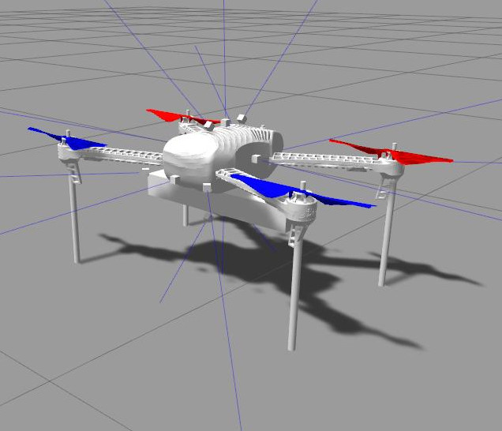

# MAV navigation in an enclosed environment

This repository contains ROS nodes for MAV navigation in a cavern tunnel environment
which is simulated by Gazebo.


MAV models from [rotorS](https://github.com/ethz-asl/rotors_simulator).


The environment model is based on the dataset of Indian Tunnel, which was originally created by CMU and is currently maintained by NASA.
https://ti.arc.nasa.gov/dataset/caves/

# System Requirements

- Ubuntu 18.04 Bionic
- ROS Melodic
- Gazebo9

# Installation

If you do not have wstool,
```
sudo apt-get install python-wstool
```

Make a new catkin workspace.

Assuming you are in the workspace, make a `src` directory in it.
```
mkdir src
cd src
```

Then, run the following commands.
```
wget https://raw.githubusercontent.com/tidota/mav-tunnel-nav/master/mav_tunnel_nav.rosinstall
wstool init . mav_tunnel_nav.rosinstall
wstool update
rosdep install --from-paths . --ignore-src --rosdistro=melodic --skip-keys "octomap_ros" -y
sudo apt install ros-melodic-octomap-ros
sudo apt install ros-melodic-rotors-*
```

## libmav_msgs.so
There is a problem related to libmav_msgs.so. The library file is not included if rotorS was installed by apt.
https://github.com/ethz-asl/rotors_simulator/pull/506

download [libmav_msgs.so](https://drive.google.com/open?id=1VtutTPUiwGTCpCeF32B7m4G2noUGp75N) and copy it to

```
/opt/ros/melodic/lib/
```

# Setup of the Simulation Environments

To run a simulation, you need world models.

Download `models.zip` from https://drive.google.com/file/d/1XFQKM-PIM0M39C8rlT6tAcLINDL0DOhb/view?usp=sharing

Then, extend it and move the items into `~/.gazebo/models/`.

# How to run
Open three terminals, and go to the workspace in each terminal.

In terminal 1,
```
. devel/setup.bash
roslaunch mav_tunnel_nav depthcam_nav.launch
```
Then, the ROS nodes for the navigation and `gzserver` will run.

In terminal 2,
```
. devel/setup.bash
roslaunch mav_tunnel_nav gui.launch
```
Then, `gzclient` and `rviz` will run.

In terminal 3, ***after the navigation program starts mapping,***
```
. devel/setup.bash
rosservice call /iris/enable "data: true"
```
Then, Iris starts to fly.

## Running on multiple machines
This repo contains a bash script to run the ROS nodes on multiple machines:
`src/mav-tunnel-nav/scripts/network_setup.sh`
This will set environment variables required for network settings of ROS and
Gazebo.
The values are very specific to the author's environment. ***Please edit the
script for your network settings (hostname, etc).***

After editing the script,
in every terminal on all machines, go to the workspace and run the following
command.
```
. src/mav-tunnel-nav/scripts/network_setup.sh
```

If the launch file is executed through SSH, the environment variable `DISPLAY`
must be set to `:0` as `gzserver` apparently needs to use the graphic card to
simulate a camera. You can run roslaunch like this.
```
DISPLAY=:0 roslaunch mav_tunnel_nav depthcam_nav.launch
```
Then, the whole picture looks like this.
```
+-----------------+        +------------------+
|                 |        |                  |
|                 |        |     roscore      |
|      rviz      <----------> other ROS nodes |
|     gzclient    |        |     gzserver     |
|                 |        |                  |
| [local machine] |        | [remote machine] |
+-----------------+        +------------------+
```

## Running across network one of which is behind NAT
`gzserver` also directly connects to `gzclient` by opening an arbitrary port.
If `gzclient` is running in a network behind NAT, `gzserver` cannot connect to
it.

Packets from `gzserver` need to be forwarded so that they can go through NAT.
`sshuttle` can make it possible.
Note: In this case, you need to work on the machine behind NAT. You also need to
install `sshuttle` on the other machine so that it can connect to your machine.

Let's say the other machine's name is `seilon-3` and has an account `tidota` and
the local network address behind NAT is `10.24.5.0/24`.

Open a separate terminal, connect to the machine with reverse tunnel.
```
ssh tidota@seilon-3 -R 2222:localhost:22
```
Then, run sshuttle on that machine.
```
sshuttle --dns -r tidota@localhost:2222 10.24.5.0/24
```

After that, gzserver can run on the other machine (`seilon-3`) and can connect
to gzclient running on your machine.
```
    10.24.5.0/24            NAT|              Internet
                               |
+-------------------+          |          +--------------------+
|                   |          |          |                    |
|      +-----------------------------------------------+       |
|      |            |          |          |            |       |
|      |            |          |          |            V       |
|      |            |          |          |       roscore      |
|    rviz           |          |          |    other ROS nodes |
|  gzclient         |          |          |       gzserver     |
|      ^            |          |          |            |       |
|      |          +-------------------------+          |       |
|      |          |   reverse SSH tunnel    |          |       |
|      |          |      and sshuttle       |          |       |
|      +----- port# 22 <--------------- port# 2222 <---+       |
|                 |                         |                  |
|                 +-------------------------+                  |
|  [local machine]  |          |          |  [remote machine]  |
+-------------------+          |          +--------------------+
```
